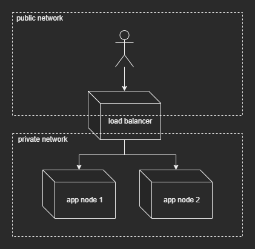
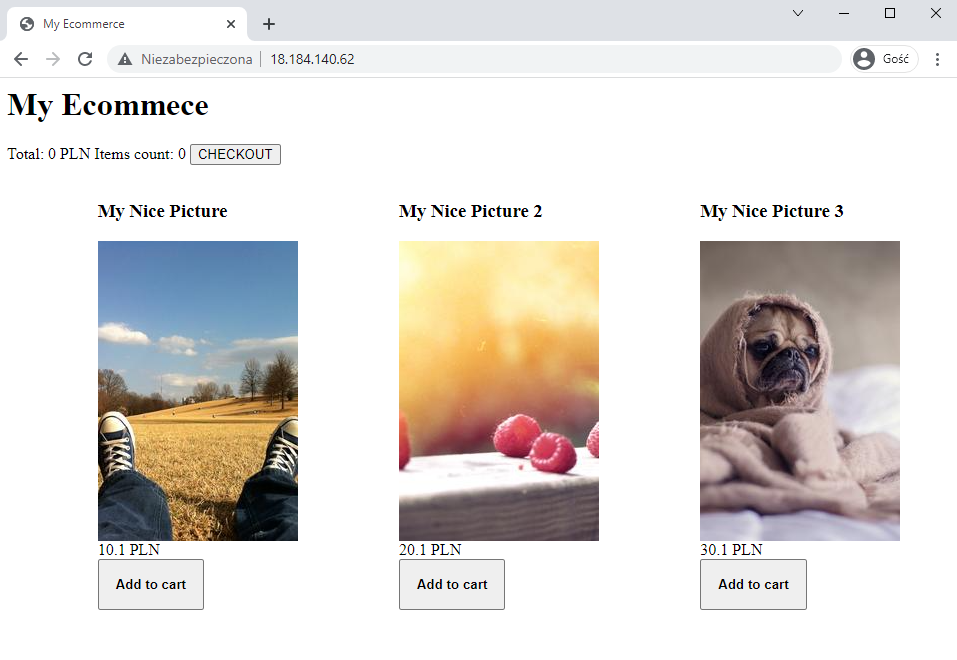

# Automate UEK e-commerce install

## Setup nodes to install application on

Whole application requires worker nodes and load balancer.
Use `app` as worker nodes and `lb` as load balancer
```ini
[app]
1.2.3.4 ansible_user=ec2-user
2.3.4.5 ansible_user=ec2-user

[lb]
3.4.5.6 ansible_user=ec2-user
```


## Setup ssh keys

Use _ssh-agent_ to manage your ssh keys

1. Start _ssh-agent_ service
    ```sh
    eval 'ssh-agent'
    ```
1. Add your key
    ```sh
    ssh-add /path/to/your/key
    ```


## Test connection to nodes

> __Important:__ Requires available ssh keys. 

```bash
ansible -m ping -i hosts.ini
```


## Ansible responsibilities

Ansible will be responsible for whole installation and configuration process:
1. Application
    1. Install Java
    1. Download application
    1. Create configuration directory
    1. Put configuration files
    1. Start application
1. Load balancer
    1. Install EPEL repo
    1. Install nginx server
    1. Configure server
    1. Restart after configuration


## Create services configuration files

Required config files:
1. Systemd `.service`
1. Envs
1. Nginx `.conf`


# Usage

To apply provided configuration

1. Create virtual machines (or just prepare their public IPs)
1. Adjust `hosts.ini` to match your machines addresses
1. Adjust `vars` in `setup.yaml` to match your needs (especially credentials :wink: )
1. Let ansible to the rest
    ```sh
    ansible-playbook -i hosts.ini setup.yaml
    ```


# Network




# Proof


